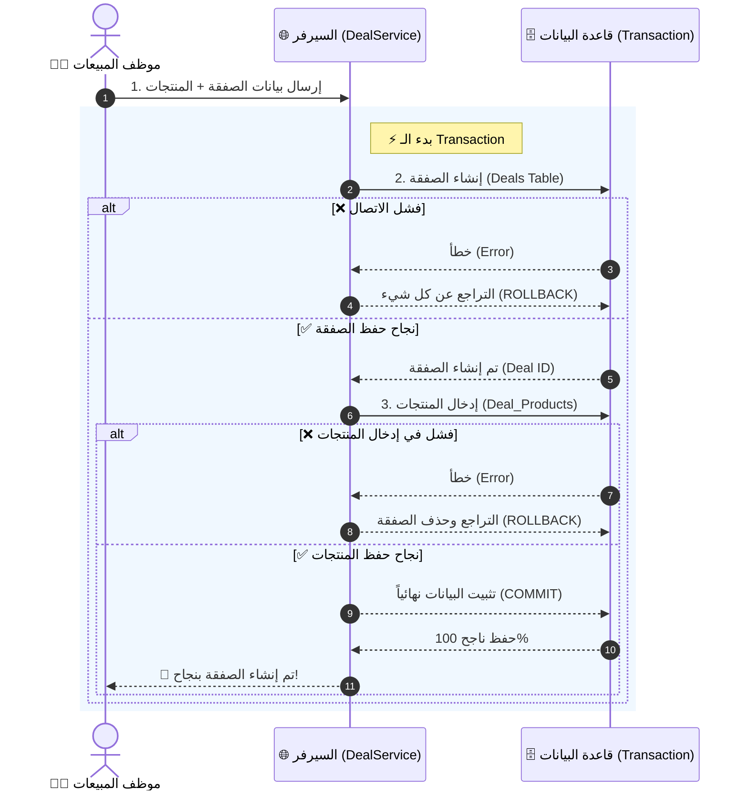
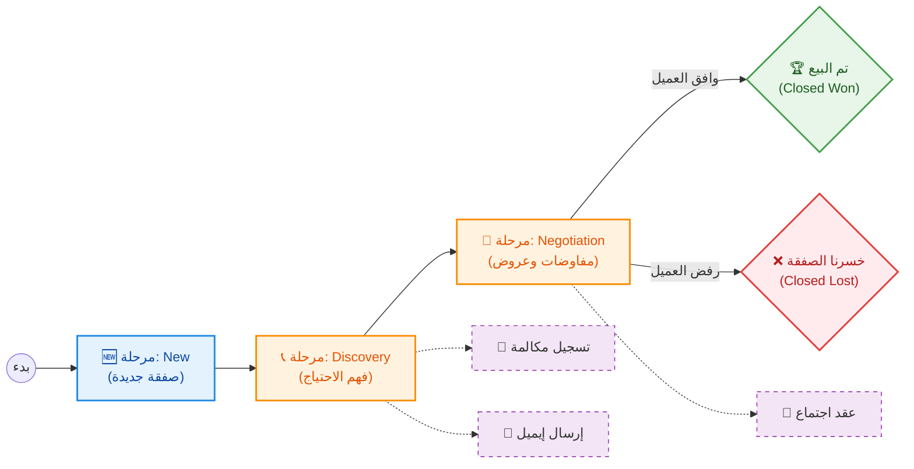

# 🔄 مسار الصفقات: من الحفظ التقني إلى الإدارة (Deal Lifecycle)

لجعل الرؤية أوضح وأكثر راحة للعين، قمنا بفصل **المسار التقني (الذي يستغرق أجزاء من الثانية)** عن **المسار الإداري (الذي يستغرق أياماً أو شهوراً)**، حيث أن المسار الإداري لا يبدأ إلا بعد نجاح المسار التقني.

---

## ⚙️ 1. الجانب التقني: عملية حفظ الصفقة (Database Transaction)
هذا المخطط التسلسلي (Sequence Diagram) يوضح ما يحدث في "الخلفية" بمجرد ضغط موظف المبيعات على زر **حفظ**.

---

## 💼 2. الجانب الإداري: دورة حياة الصفقة (Deal Stages)
بمجرد نجاح العملية التقنية بالأعلى، تظهر الصفقة في النظام وتبدأ دورتها الإدارية التي يتفاعل معها فريق المبيعات. استخدمنا هنا (Flowchart) بتسلسل من اليسار لليمين مريح للعين، مع ألوان تعبر عن حالة الصفقة.

### 💡 الخلاصة:
- **المخطط الأول (التسلسلي):** يحمي النظام من تخزين بيانات مشوهة (مثل صفقة بدون منتجاتها).
- **المخطط الثاني (دورة الحياة):** يحكم سير العمل والمتابعة مع العملاء بشكل يومي.
